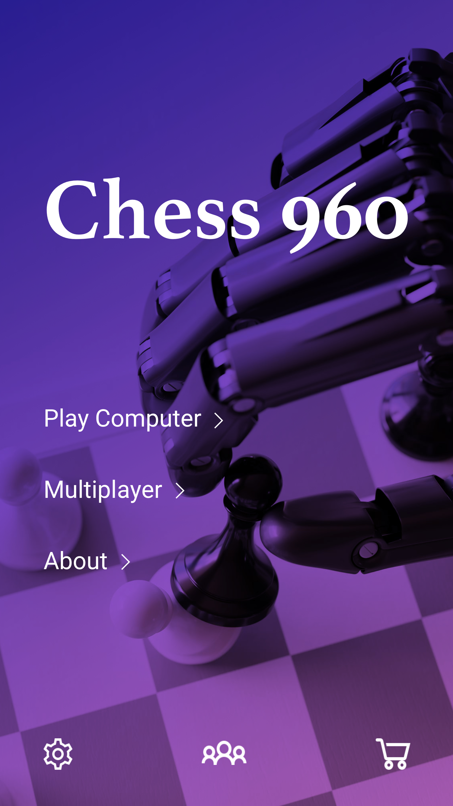

**FischerRandom (Chess960)**
============================

*Fischeri malemängu rakendus* https://en.wikipedia.org/wiki/Chess960

Fischreri male autoriks on eksmaailmameister Robert Fischer. Fischeri male erineb traditsioonilisest malest selle poolest, et mängijate figuuride algseis on juhuslik. Siiski eksisteerivad järgmised reeglid figuuride paigutusele:
Etturid asuvad tavalistel väljadel (teises ja seitsmendas reas).
Kuningas peab olema kahe vankri vahel. .
Üks oda peab olema valgel, teine mustal väljal.
Valge ja musta algseis on sümmeetriline - samad vigurid on samadel liinidel.

Liikmed
-------

Viktor Pavlov (vpavlo)

Funktsionaalsus
---------------

- Multiplayer
- Play against computer

**AI**

- ühendus chess engine'ga (Stockfish, Houdini etc)
- või oma variant (Alpha-Beta, Minimax)

Design
------

.. image::uml.png

Plaan
-----

- \4. nädal: projektiplaaniga alustamine/ MVC setup/ Struktuur
- \5. nädal: Esimesed klassid (pieces)
- \6. nädal: projektiplaani esitamine, Klassid game, Player, Board
- \7. nädal: mängu loogika, disain
- \8. nädal: mängu loogika, Unit tests
- \9. nädal: GUI alustamine
- \10. nädal: GUI
- \11. nädal: GUI?
- \12. nädal: ühendus chess engine'ga?
- \13. nädal: ??????
- \14. nädal: ??????
- \15. nädal: ??????
- \16. nädal: Lõplik esitamine

Kasutatav tehnoloogia
---------------------

JavaFX

Punktisoov
----------

8+ punkti

